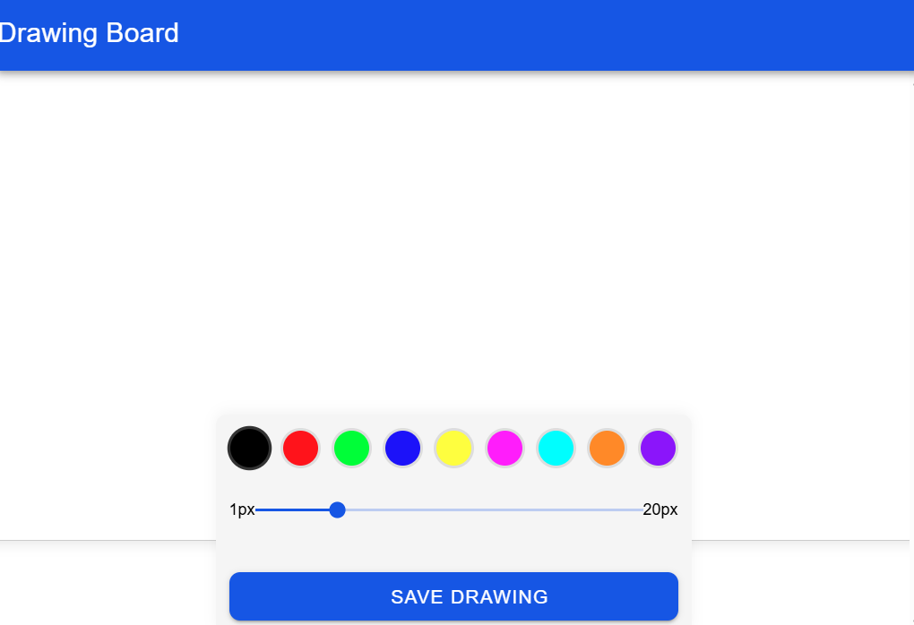

# Drawing Board App

A freehand drawing application built with Angular and Ionic that allows users to draw on a canvas element using mouse or touch input.



## Features

- Real-time drawing that follows cursor/touch movement
- Smooth line rendering with adjustable width
- Color selection from a palette of 9 colors
- Support for both mouse and touch input
- Save drawings as PNG or JPEG files
- Responsive design for desktop and mobile devices
- Angular standalone components with Ionic UI

## Technologies Used

- **Framework:** Angular 19.2.0
- **UI Components:** Ionic Angular
- **Drawing Interface:** HTML5 Canvas API
- **State Management:** RxJS
- **Build System:** Angular CLI

## Project Structure

```
src/
├── app/
│   ├── components/
│   │   ├── drawing-canvas/     # Canvas drawing component
│   │   └── drawing-toolbar/    # Color and line width controls
│   ├── pages/
│   │   └── home/               # Main application page
│   ├── services/
│   │   └── drawing.service.ts  # Drawing state management
│   ├── app.component.ts        # Root component
│   ├── app.config.ts           # App configuration
│   └── app.routes.ts           # Routing configuration
└── styles.scss                 # Global styles
```

## Getting Started

### Prerequisites

- Node.js (latest LTS version)
- npm or yarn

### Installation

1. Clone the repository:

```bash
git clone https://github.com/yourusername/drawing-board-app.git
cd drawing-board-app
```

2. Install dependencies:

```bash
npm install
```

3. Start the development server:

```bash
npm start
```

4. Open your browser and navigate to `http://localhost:4200/`

## Usage Instructions

1. **Drawing:** Click and drag (or touch and drag) on the canvas to draw
2. **Color Selection:** Click on any color circle in the toolbar to select a drawing color
3. **Line Width:** Use the slider to adjust the thickness of the drawing line
4. **Save Drawing:** Click the "Save Drawing" button to export your artwork
   - Choose between PNG (best quality) or JPEG (smaller size)
   - The file will automatically download to your device
5. **Responsive:** Works on desktop browsers and mobile devices

## Implementation Details

### Drawing Mechanism

The application uses the HTML5 Canvas API for drawing operations. The drawing process:

1. Captures mouse/touch events from the user
2. Translates cursor/touch positions to canvas coordinates
3. Uses `lineTo()` and `stroke()` methods to render lines in real time
4. Provides smooth line rendering with rounded caps and joins

### State Management

The drawing state is managed through a service that:

- Maintains the current color and line width
- Uses RxJS BehaviorSubjects for reactive state updates
- Provides getters and setters for components to interact with the drawing state
- Handles canvas-to-image conversion for saving drawings

### Responsive Design

The canvas automatically adjusts to different screen sizes by:

- Resizing on window resize events
- Setting dimensions based on parent container size
- Supporting touch events for mobile devices

## Future Enhancements

- Clear canvas functionality
- Undo/redo operations
- Multiple brush types
- Layer support
- Cloud storage integration

## Development

### Building the Project

```bash
ng build
```

Build artifacts will be stored in the `dist/` directory.

### Running Tests

```bash
ng test
```

## License

This project is licensed under the MIT License - see the LICENSE file for details.

## Acknowledgments

- Angular team for the powerful framework
- Ionic team for the UI components
- HTML5 Canvas API for drawing capabilities
